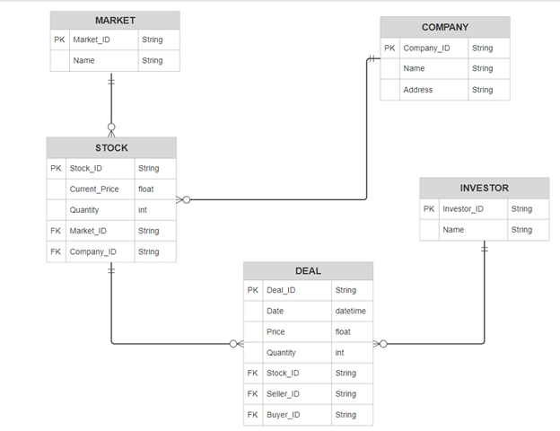
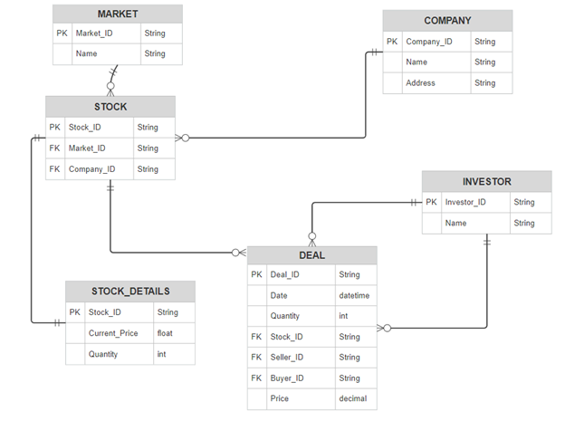

# Stock Trading Database Project

## Overview
This project represents a relational database system for managing stock trading activities. The database tracks stocks, deals, investors, markets, and companies.

## Database Schema
The database includes the following tables:

1. **Market**
   - `Market_ID` (PK)
   - `Name`

2. **Company**
   - `Company_ID` (PK)
   - `Name`
   - `Address`

3. **Stock**
   - `Stock_ID` (PK)
   - `Market_ID` (FK)
   - `Company_ID` (FK)
   - `Current_Price`
   - `Quantity`

4. **Investor**
   - `Investor_ID` (PK)
   - `Name`

5. **Deal**
   - `Deal_ID` (PK)
   - `Date`
   - `Quantity`
   - `Stock_ID` (FK)
   - `Seller_ID` (FK)
   - `Buyer_ID` (FK)
   - `Price`

6. **Stock_Details**
   - `Stock_ID` (PK)
   - `Current_Price`
   - `Quantity`

## ER Diagram
The ER diagram shows the relationships between these tables, including primary and foreign key constraints. 



## Normalization
The database follows Third Normal Form (3NF):
1. All non-key attributes are fully dependent on the primary key.
2. There is no transitive dependency.



## SQL Schema
```sql
-- Market Table
CREATE TABLE Market (
    Market_ID VARCHAR(255) PRIMARY KEY,
    Name VARCHAR(255) NOT NULL
);

-- Company Table
CREATE TABLE Company (
    Company_ID VARCHAR(255) PRIMARY KEY,
    Name VARCHAR(255) NOT NULL,
    Address VARCHAR(255)
);

-- Stock Table
CREATE TABLE Stock (
    Stock_ID VARCHAR(255) PRIMARY KEY,
    Market_ID VARCHAR(255) NOT NULL,
    Company_ID VARCHAR(255) NOT NULL,
    FOREIGN KEY (Market_ID) REFERENCES Market(Market_ID),
    FOREIGN KEY (Company_ID) REFERENCES Company(Company_ID)
);

-- Stock Details Table
CREATE TABLE Stock_Details (
    Stock_ID VARCHAR(255) PRIMARY KEY,
    Current_Price FLOAT NOT NULL,
    Quantity INT NOT NULL,
    FOREIGN KEY (Stock_ID) REFERENCES Stock(Stock_ID)
);

-- Deal Table
CREATE TABLE Deal (
    Deal_ID VARCHAR(255) PRIMARY KEY,
    Date DATETIME NOT NULL,
    Quantity INT NOT NULL,
    Stock_ID VARCHAR(255) NOT NULL,
    Seller_ID VARCHAR(255) NOT NULL,
    Buyer_ID VARCHAR(255) NOT NULL,
    Price DECIMAL(10, 2),
    FOREIGN KEY (Stock_ID) REFERENCES Stock(Stock_ID),
    FOREIGN KEY (Seller_ID) REFERENCES Investor(Investor_ID),
    FOREIGN KEY (Buyer_ID) REFERENCES Investor(Investor_ID)
);

-- Investor Table
CREATE TABLE Investor (
    Investor_ID VARCHAR(255) PRIMARY KEY,
    Name VARCHAR(255) NOT NULL
);

DELIMITER $$
CREATE TRIGGER Calculate_Deal_Price
BEFORE INSERT ON Deal
FOR EACH ROW
BEGIN
    DECLARE current_price DECIMAL(10, 2);
    SELECT Current_Price INTO current_price FROM Stock_Details WHERE Stock_ID = NEW.Stock_ID;
    SET NEW.Price = current_price * NEW.Quantity;
END$$
DELIMITER ;

-- Stored procedure to get deals by stock and date
DELIMITER //
CREATE PROCEDURE GetDealsByStockAndDate(IN StockID VARCHAR(255), IN StartDate DATE, IN EndDate DATE)
BEGIN
    SELECT * FROM Deal
    WHERE Stock_ID = StockID AND Date >= StartDate AND Date <= EndDate;
END //
DELIMITER ;

-- Stored procedure to update stock price
DELIMITER //
CREATE PROCEDURE UpdateStockPrice(IN StockID VARCHAR(255), IN NewPrice FLOAT)
BEGIN
    UPDATE Stock_Details
    SET Current_Price = NewPrice
    WHERE Stock_ID = StockID;
END //
DELIMITER ;
```

## Installation
1. Clone the repository:
   ```bash
   git clone https://github.com/test/stock-trading-db.git
   ```
2. Import the SQL schema:
   ```sql
   source Code.sql;
   ```

## Usage
- Run queries on the database to track stock deals, investor portfolios, and market analytics.


---
Developed by **OVM** and **Nassir**.

GitHub Account: [https://github.com/Nassirx1](https://github.com/Nassirx1)

